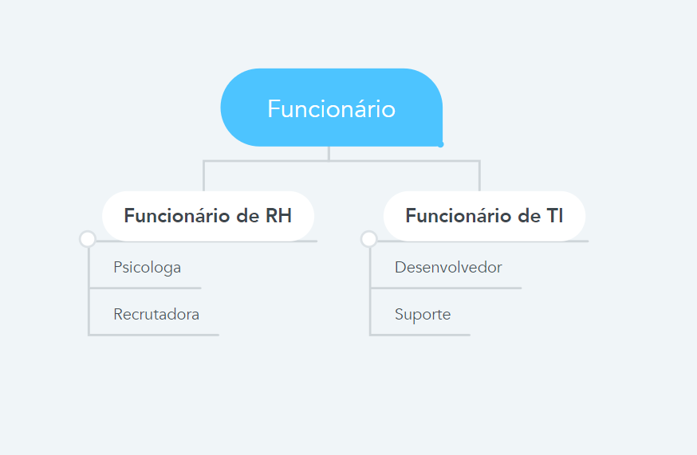
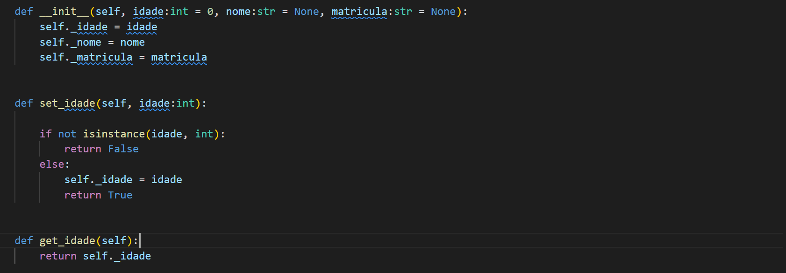
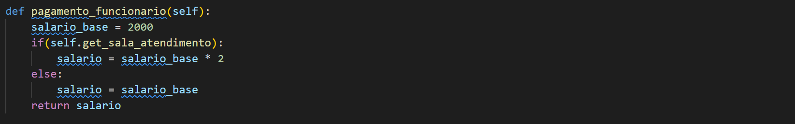
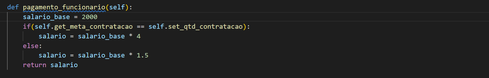
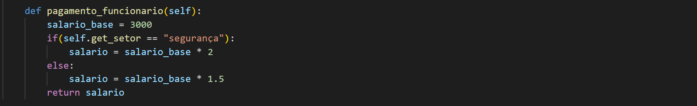
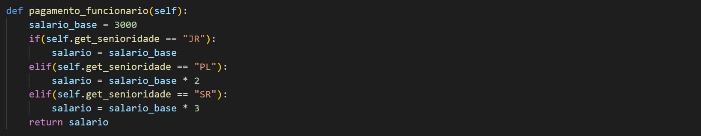
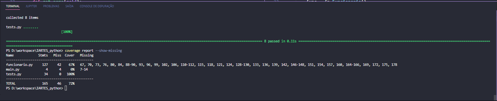
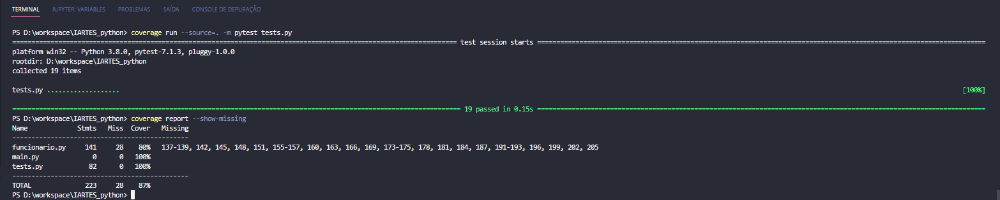
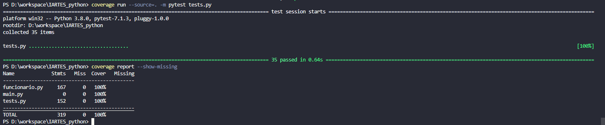

# Projeto final para a disciplina de Python

## Equipe CyberIARTES
- Bruno Souza
- Eloise Miranda
- João Paulo Marques
- Mônica Lima

Link do projeto no GitHub: https://github.com/bruno4souza/IARTES_python

## 1. Introdução

Nosso programa vai contextualizar o registro de funcionários de uma Startup  através de uma programação orientada a objetos, na qual vamos abstrair algumas funções e cargos, que são comuns em setores presentes no mercado de trabalho.  

## 2. A hierarquia

Pensando em um cenário real de uma empresa, a seguinte hierarquia foi implementada. 

Como é possível perceber, o esquema de funcionários da nossa empresa pôde ser implementado utilizando o conceito de herança da orientação a objeto. Assim, a nossa classe pai é "Funcionario", as classes "FuncionarioRH" e "FuncionarioTI" são classes filhas e por sua vez, as classes Psicologa, Recrutadora, Desenvolvedor e Suporte são classes netas como pode ser observado na imagem abaixo.

## 2.1. Funcionario
- Atributos: idade, nome e matricula
- Métodos: pegar_funcionario, maiorIdade e pagamento_funcionario

Herança: Esta classe é a pai (abstrata)

Polimorfismo: Foi definido o método abstrato pagamento_funcionario, que foi implementado de diferentes formas nas classes que herdam Funcionario.

Encapsulamento: Para todos os atributos utilizamos o conceito de encapsulamento de orientação a objeto. Por isso, esses atributos são todos privados e só podem ser acessados por meio dos métodos set/get. Na imagem abaixo, segue um exemplo da implementação do conceito de encapsulamento.

## 2.2. FuncionarioRH
- Atributos: atributos da classe pai e qtde_palestras
- Método: registrar_palestra

Herança: Esta classe é filha de Funcionario

Polimorfismo: Esta classe não possui um exemplo de polimorfismo.

Encapsulamento: O atributo qtde_palestras foi definido como privado, sendo manipulado apenas pelos métodos get/set.

## 2.3. FuncionarioTI
- Atributos: atributos da classe pai, senha_rede e id_computador
- Método: logar_rede

Herança: Esta classe é filha de Funcionario

Polimorfismo: Esta classe não possui um exemplo de polimorfismo.

Encapsulamento: Os atributos senha_rede e id_computador foram definidos como privado, sendo manipulados apenas pelos métodos get/set.

## 2.4. Pisicologa
- Atributos: atributos da classe pai(Funcionario), da filha(FuncionarioRH), crp, sala_atendimento e qtde_avaliacao.
- Método: avaliar_candidato e pagamento_funcionario

Herança: Esta classe é neta de Funcionario e filha de FuncionarioRH

Polimorfismo: O método herdado da classe Funcionario é implementado para o Psicologo, para o pagamento deste cargo a conta do pagamento é feita com base na palestra oferecida, caso o atributo seja True o salário é dobrado. (Imagem do método abaixo)

Encapsulamento: Os atributos senha_rede e id_computador foram definidos como privado, sendo manipulados apenas pelos métodos get/set.

## 2.5. Recrutadora
- Atributos: atributos da classe pai(Funcionario), da filha(FuncionarioRH), meta_contratacao, qtd_contratacao, tipo_recrutamento e vagas_disponíveis.
- Método: recrutar_funcionario, meta_alcancada e pagamento_funcionario

Herança: Esta classe é neta de Funcionario e filha de FuncionarioRH

Polimorfismo: O método herdado da classe Funcionario é implementado para a Recrutadora, para o pagamento deste cargo, o salário se baseia na meta de contratação obtida, caso a meta seja atingida o salário é multiplicado por 4, caso não seja é multiplicado por 1.5. (Imagem do método abaixo)

Encapsulamento: Os atributos foram definidos como privado, sendo manipulados apenas pelos métodos get/set.

## 2.6. Suporte
- Atributos: atributos da classe pai(Funcionario), da filha(FuncionarioTI), setor, especialidade e qtde_atendimento.
- Método: registrar_atendimento e pagamento_funcionario

Herança: Esta classe é neta de Funcionario e filha de FuncionarioTI

Polimorfismo: O método herdado da classe Funcionario é implementado para o Suporte, para o profissional deste cargo a regra se baseia no setor, caso ele seja do setor de segurança o salário é dobrado, senão ele recebe o salário base multiplicado por 1.5. (Imagem do método abaixo)

Encapsulamento: Os atributos foram definidos como privado, sendo manipulados apenas pelos métodos get/set.

## 2.7. Desenvolvedor
- Atributos: atributos da classe pai(Funcionario), da filha(FuncionarioTI), linguagem, senioridade e qtde_projetos.
- Método: registrar_projetos e pagamento_funcionario

Herança: Esta classe é neta de Funcionario e filha de FuncionarioTI

Polimorfismo: O método herdado da classe Funcionario é implementado para o Desenvolvedor, para este cargo o salário é baseado na senioridade, júnior recebe o salário base, pleno o dobro do salário base e o sênior recebe o triplo do salário base.(Imagem do método abaixo)

Encapsulamento: Os atributos foram definidos como privado, sendo manipulados apenas pelos métodos get/set.

## 3. Relatório de cobertura de código

Nossa primeira execução de cobertura de teste que alcançou 67%. Nessa primeira execução, testamos o método de validar se o funcionário é menor de idade ou não e focamos nos set/get dos atributos que são da classe principal (Funcionario), também fizemos testes para os atributos da classe filha (FuncionarioRH).

A segunda execução conseguimos 87% porcento de cobertura. Testamos os atributos que faltaram dos profissionais de TI e da Psicologa que é uma sub-classe de FuncionarioRH.

Na terceira vez que rodamos atingimos os 100% de cobertura das tarefas implementadas. Foram verificados as linhas de código faltantes.

## 4. Conclusões

Foi desenvolvido um sistema orientado a objetos para gestão dos Funcionários de uma Startup, o principal desafio enfrentado pela equipe foi na definição do tema/cenário, a princípio pensamos em uma ideia mas não conseguimos identificar métodos que poderiam ser implementados, optamos então por esta implementação.
