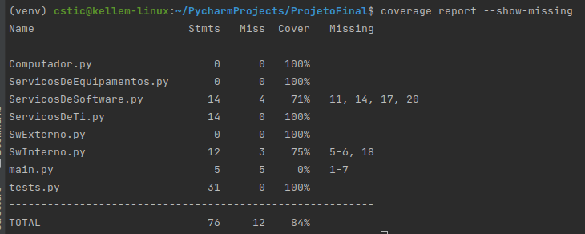
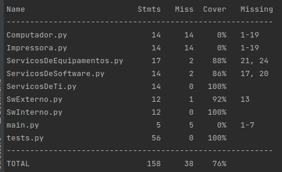
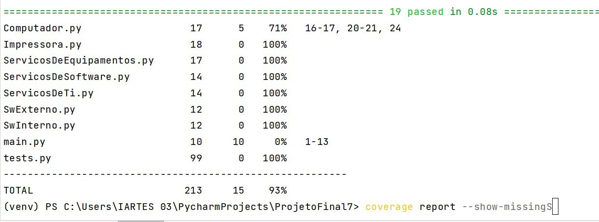
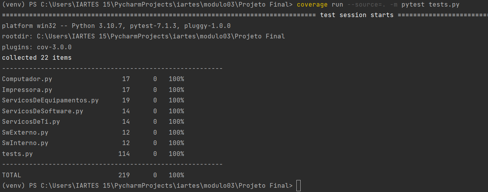

# Relatório do Projeto Final

## 1. Introdução

Trata-se de um programa sobre Gerenciamento de Serviços de TI

Os serviços podem ser para Software ou para Equipamentos.

Existem Softwares internos e/ou externos e Equipamentos como Computador e/ou impressora.

No diagrama de classes, contém os atributos, métodos e saída esperados que deverão ser testados. 

## 2. Hieraquia (UML)


## 3. Conceitos de POO aplicados
   1. Herança

Abaixo está um trecho de código que representa a Herança da Classe 
ServicosDeEquipamentos() para Impressora(), reafirmando a abstração 
de "Serviço em Impressora é um tipo de Serviço de Equipamento que
é um tipo de Serviço de TI"

````
from ServicosDeEquipamentos import ServicosDeEquipamentos


class Impressora(ServicosDeEquipamentos):
    def __init__(self, multifuncional, tombamento, modelo, os):
        super().__init__(tombamento, modelo, os)
        self.multifuncional = multifuncional
   
````

   2. Polimorfismo

Função "substituir(modelo,tombamento)" definida para Equipamentos que terá comportamento 
diferente para Impressora. Registrando ainda que nessa implementação, haverá 
alteração nos atributos da modelo e tombamento da classe.

````
class ServicosDeEquipamentos(ServicosDeTi):

    # Outros Métodos

    def substituir(self, modelo, tombamento):
        self.set_modelo(modelo)
        self.set_tombamento(tombamento)
        result = 'Novo Modelo: ' + self.get_modelo() + ', Novo Tombamento:' + str(self.get_tombamento())
        return result

````

Método substituir(modelo, tombamento) apresentando polimorfismo.

````
class Impressora(ServicosDeEquipamentos):
    def __init__(self, multifuncional, tombamento, modelo, os):
        super().__init__(tombamento, modelo, os)
        self.multifuncional = multifuncional

    # Outros métodos

    def substituir(self, nvmodelo, nvtombamento):
        return super().substituir(nvmodelo, nvtombamento)


````

   3. Encapsulamento

Métodos get e set da classe ServicosDeSoftware() 

````
class ServicosDeSoftware(ServicosDeTi):
    def __init__(self, versao, nome, os):
        super().__init__(os)
        self.versao = versao
        self.nome = nome

    def get_versao(self):
        return self.versao

    def set_versao(self, versao):
        self.versao = versao

    def get_nome(self):
        return self.nome

    def set_nome(self, nome):
        self.nome = nome

````

## 3. Relatório de Cobertura de Código
   1. Cobertura com 50% do código desenvolvido

Abaixo está descrito a cobertura do códifo com 3 classes implementadas

Classes implementadas:
* ServicosDeTi.py
* ServicosDeSoftware.py 
* SwInterno.py



   2. Cobertura com 70% do código desenvolvido

Abaixo está descrito a cobertura do códifo com 5 classes implementadas

Classes implementadas:
* ServicosDeTi.py
* ServicosDeSoftware.py 
* SwInterno.py
* __SwExterno.py__
* __ServicosDeEquipamento.py__



   3.  Cobertura com 80% do código desenvolvido

Ajustes na Classe Computador.py. Classes implementadas:
* ServicosDeTi.py
* ServicosDeSoftware.py 
* SwInterno.py
* SwExterno.py
* ServicosDeEquipamento.py
* __Impressora.py__
* __Computador.py__ (parcial)




   4. Cobertura com 100% do código desenvolvido




## 4. Conclusões

Foi desenvolvido um programa de Gerenciamento de Serviços de TI com serviços de Software e para Equipamentos, considerando os paradigmas TDD e POO(Abstração, Herança, Encapsulamento, Polimorfismo). Atributos e métodos getters e setters foram criados em cada classe e tiveram suas saídas testadas usando PyTest. 
 
O processo de avaliação de cobertura do código foi executado em quatro fases, 50%, 70%, 80% e por fim, 100%. Tendo a cobertura completa do código desenvolvido.

A mudança de perspectiva ao orientar o desenvolvimento para testes, indicando incialmente dos casos possíveis de entrada para cada classe, proporcionou um melhor controle do escopo do desenvolvimento, sendo possível, ainda que em desenvolvimento colaborativo, ter maior gerência sobre as falhas do código, uma vez que os cenários possíveis foram levantados no início do projeto. 
