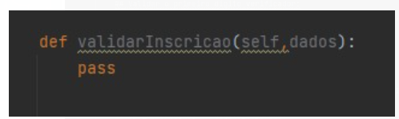



Relatório 
## **Conceitos de POO no contexto de TDD**

**Equipe:**

Ana Paula Cardoso

Marlon Griego

Pablo Diego 

Cleicy Priscilla Aragão dos Santos
1. ## **Introdução.**
Para esse relatório final usamos o conceito de criação de contas bancárias e movimentação.

Para as **Classe Raiz**: Classe Movimento

Para **Classe abstrata**: Classe Pessoa

1. ## **Herança**
A classe **pessoa\_juridica** e a classe **pessoa\_fisica** herdam seus atributos da classe pessoa.py

Figura-1 Diagrama de Classe
## **3.Polimorfismo**
Para validar a inscrição dentro da classe **Pessoa** foi criado o método **validarInscrição,** onde a implementação varia **na classe pessoa\_juridica** e **pessoa\_fisica.**

##

## **4.Encapsulamento.**
Usamos encapsulamento para proteger os dados da conta na classe **conta\_comum** e proteger os dados da pessoa classe **pessoa\_fisica**. 

## **5. Relatório de cobertura do código.**
5.1 Cobertura inicial 

5.2 Cobertura Final 

## **6. Conclusões.**

Criamos classe para simular a criação de conta bancária e movimentação, também foi desenvolvido cálculo de rendimento dessas contas. 

Durante o desenvolvimento, tivemos dificuldade de encontrar uma classe usada no cotidiano, que atendesse todos os requisitos do trabalho final. Também tivemos algumas dificuldades para definição de métodos para algumas classes. 

