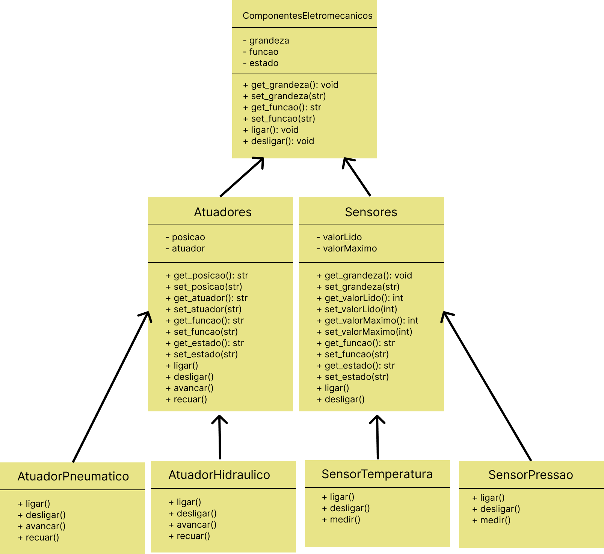
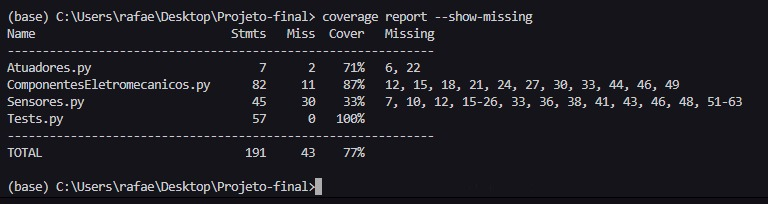
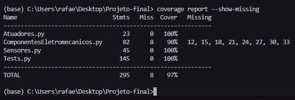

# Introdução

Esta hierarquia está voltada para o contexto da área de engenharia elétrica, onde são descritos 3 níveis de hieraquia de Classes
começando com 'Componentes_Eletromecanicos', que seria a classe abstrata. Em seguida classificamos o segundo nível da hierarquia como
as Classes de 'Sensores' e 'Atuadores', e em seguida o ultimo nível com mais duas classes derivadas de cada uma das classes anteriores que
exemplificam alguns exemplos de sensores e atuadores existentes na eletrônica, que são as classes 'SensorTemperatura', 'SensorPressao', 
'AtuadorPneumatico' e 'AtuadorHidraulico'. A Figura abaixo mostra o diagrama de classes nos três níveis implementados.

# Hierarquia
A hierarquia dos três níveis implementados representam as abstrações mostradas na classe-mãe conforme mostrada na Figura acima.

# Herança
Como exemplo de herança, destacam-se as classes 'Atuadores' e 'Sensores' que herdam a classe 'ComponentesEletromecanicos'. Além disso,
As classes 'SensorTemperatura' e 'SensorPressao' herdam a classe 'Sensores', assim como 'AtuadorPneumatico' e 'Atuador Hidraulico'
herdam a classe 'Atuadores'.

# Polimorfismo
Como exemplo de polimorfismo, pode-se destacar, como exemplo, a reimplementação dos métodos 'ligar()' e 'desligar()' das classes 'Sensores' nas classes
do terceiro nível.

 ### Implementação das classes 'ligar()' em Sensores
        def ligar(self):
            self.set_estado('Sensor ligado')
 ### Implementação das classes 'desligar()' em Sensores
        def desligar(self):
            self.set_estado('Sensor desligado')
 ### Implementação das classes 'ligar()' em SensoresTemperatura
        def ligar(self):
            self.set_estado('Sensor de pressão ligado')
 ### Implementação das classes 'desligar()' em SensoresPressao
        def desligar(self):
            self.set_estado('Sensor de pressão desligado')

# Encapsulamento
Como exemplo de encapsulamento, pode-se destacar a implementação das funções get e set para
todos os atributos de todas as classes. Na função 'ligar()' da classe Sensores por exemplo,
é chamada a função de set para a variável 'estado'.

### Chamada de 'set_estado()' em 'ligar()' na classe Sensores
    def ligar(self):
        self.set_estado('Sensor ligado')

# Relatório de cobertura de código

    - Resultado de 54% coberto

Implementação feita até metade da segunda hierarquia
    
    - Resultado de 77% coberto

Implementação feita até o segundo nível de hierarquia 

    - Resultado de 97% coberto

# Conclusoes

Foi desenvolvido um modelo de hierarquia para um segmento de componentes eletrônicos muito comuns em projetos do curso de engenharia eletrica, utilizando a programação
orientada a objeto priorizando a pratica dos conceitos de polimorfismo, encapsulamento e herança em python, com desevolvimento orientado a teste. O maior desafio foi definir 
a estrutura da hieraquia pensando nos metodos que seriam implementados para obter os atributos e os casos de teste. Além disso, a sintaxe específica para POO em python também foi o desafio.